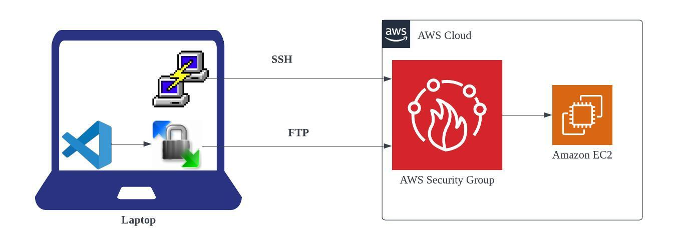

### Shell Scripting
 
If you were given a task, instead of running multiple commands to complete the task manually, you can simply put those commands in a file and run it as a script that does the task without human errors.

I am going to cover everything in shell scripting from basics to advanced.

### ENV SetUp

**Pre-requisite:** Linux basic knowledge

##### Pre-Requisites for this repo

* AWS Account
* Putty or Super Putty or Git Bash or Mobaxterm
* WinScp
* IDE (NotePad++/VS Code)

### **Steps:**

* Create one security group on default VPC.
* Launch EC2, we use centos 8
* Connect through putty or Super Putty, WinScp
* Setup NotePad++ or VS Code as IDE in WinScp.

### OS used

I am mostly using centos 8. You can use any OS like Ubuntu, Centos, Ec2 etc. Few commands will be changed based on OS.

* For Ubuntu username is ubuntu.
* For Centos username is centos.
* For AWS Linux 2 username is ec2-user.

### Coding
Coding is 2 types.
* **Programming**  
    Programming can be done by developers. Usually it has complex coding like data base transactions, session management, triggering communications, etc. Developers should write code in an effective way that should consume less memory and less time more speed.
* **Scripting**  
    Scripting is done by generally system admins, DevOps, Cloud, Database admins, developers, etc. Scripting is usually automating manual tasks like
    * Deleting old files
    * Installing packages
    * Configuring servers
    * Adding or removing users

#### Coding Concepts
Usually coding have universal concepts.
* Variables
* Data types
* Conditions
* Functions
* Loops